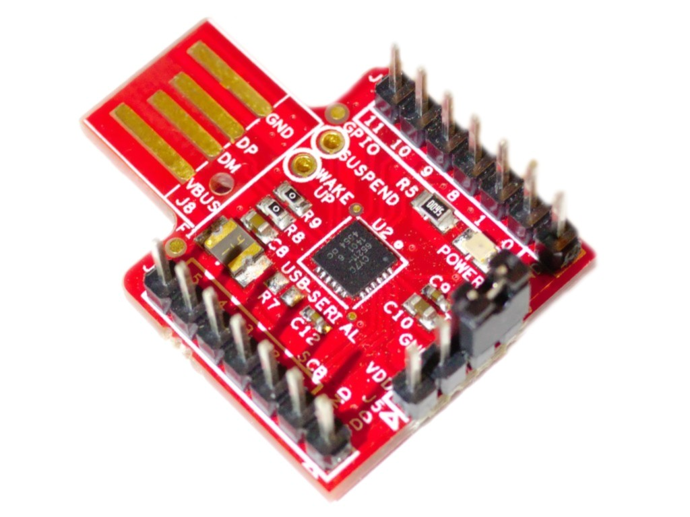
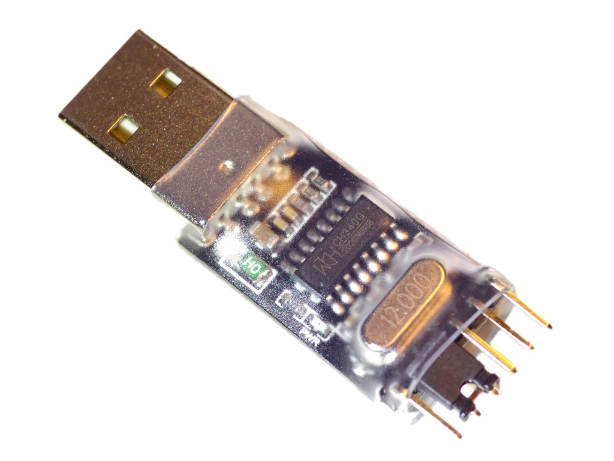
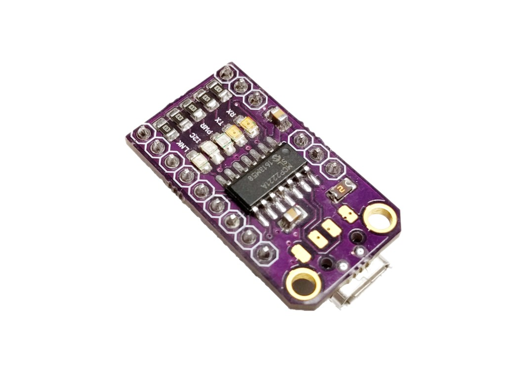

# onewire-over-uart:
## Access Dallas 1-wire bus on your PC with simple and cheap hardware.

This project is based on Maxim's application note:
Using a UART to Implement a 1-Wire Bus Master

[http://www.maximintegrated.com/app-notes/index.mvp/id/214](http://www.maximintegrated.com/app-notes/index.mvp/id/214 "Using a UART to Implement a 1-Wire Bus Master")

Please also see this post from *vbranimir*:
[https://haklabos.wordpress.com/projekti/digitemp/](https://haklabos.wordpress.com/projekti/digitemp/)

NOTE: parasitic power mode is not supported.

## License

Part of the project are based on previous works, most of which does not contain explicit licenses.
Please contact the authors separately via the email addresses listed in individual files if necessary.
Other codes are licensed under [WTFPL](http://www.wtfpl.net/).

***
### Hardware

The original version mentioned in Maxim's application note is shown as below.

However you can use a simplified version:

If you are sure your UART host has open-drain outputs,
simply tie TX and RX together as mentioned by *vbranimir*.
Transistors can either be BJTs or MOSFETs.
The diode used in the simplified version should be fast and has a relatively low forwarding voltage.
1N4148 is known to work.

A USB to UART converter with TTL output is required,
unless you are using a SBC with native TTL UART **(NOT RS-232!)** such as Raspberry Pi.
Many USB to UART converters have TTL UART interfaces.
RS-232 UARTs should be avoided since its voltage is very high and can damage your device.
If you have to use one of such, insert a MAX232 or equivalent chip
between the RS-232 port and the circuits mentioned above.
It is usually easier and cheaper to just get a USB to UART converter with TTL output.

Here are a few tested converters, many of which are less than $5:

* SiLabs CP2102 USB to UART converters. Common and cost-effective.

    

* Prolific PL2303 USB to UART converters. Common and cost-effective.
    Some boards have problems with power output, especially 3.3V.
    Try powering your 1-wire device separately should problems arise.

    

* FTDI FT232L USB to UART converters.
    More expensive.

    

* Cypress CY7C65211 USB to UART/I2C/SPI converters.
    Less common on the market, this one is broken out from a Cypress MCU development board.

    

* WCH CH340G USB to UART converters.
    Common and cheap in China but might be slow.

    

* Microchip MCP2221(A) USB to UART/I2C converters.
    DIY-friendly.

    

***
### Software

Type `make` to get `lsow` and `digitemp_evil` compiled.
To build for Windows under Linux, try installing `mingw-w64` and then type `make OS=Windows_NT CC=i686-w64-mingw32-gcc-posix`.
Project files for MS Visual Studio Express are now included.

`lsow` is a tool that list devices on a onewire bus connected to a USB to UART converter.
Simply type something like `lsow /dev/ttyUSB0`
(or something like `lsow COM0:` under Windows) and it will show device IDs found on the bus.

`digitemp_evil` is a demonstration program that reads temperature values
from DS18S20/DS18B20/DS1822 onewire digital temperature sensors.
Type `digitemp_evil /dev/ttyUSB0` to read IDs and temperature values.
It will wait for conversion to complete, which usually takes around 0.75 seconds.
Additionally, Windows users can use `digitemp_monitor.bat` to monitor the temperature.
Linux users can simply use the `watch` command.

Alternatively you can use `digitemp_DS9097` in the `digitemp` package as mentioned by *vbranimir*.
